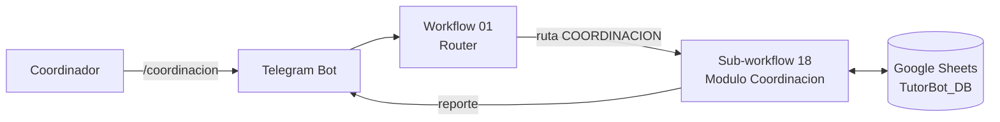

# Ejercicio · Reporte de tutorías por materia

Panel de Coordinación Académica en Telegram, sobre n8n y Google Sheets.

## El problema

La coordinación académica quiere saber qué materias concentran más solicitudes de tutoría sin
revisar registro por registro. Hoy la hoja `TUTORIAS` tiene más de cien filas y sigue creciendo:
responder "¿qué se dictó esta semana?" implica filtrar a mano por fecha y contar por materia.

**Objetivo.** Un comando en Telegram que agrupe y sume las tutorías de la semana en curso por
materia, disponible solo para el rol de coordinación.

## Cómo se usa

El coordinador escribe `/coordinacion` (o `/reportes`) y entra a un panel que no comparte nada con
el menú del estudiante:

```
Hola Nombre. Bienvenido al panel de Coordinacion Academica.

COORDINACION ACADEMICA

1) Resumen semanal por materia
2) Consultar una materia

Responde con el numero de la opcion.
```

**Opción 1** entrega el resumen completo de una vez:

```
📚 Resumen de Tutorias por Materia
Semana del 2026-09-07 al 2026-09-13
----------------------------

🧮 Calculo I: 3
💻 Programacion I: 2
🧮 Estadistica: 2
⚙️ Fisica I: 1
💻 Bases de Datos: 1
🧪 Quimica General: 1
🧮 Calculo II: 1
----------------------------
📈 TOTAL SEMANA: 11
```

**Opción 2** pregunta cuál materia y da el detalle de esa sola: finalizadas, programadas sin cerrar,
canceladas, sin cupo, participación en el total de la semana y qué tutores la dictaron.

## Los cuatro requisitos, y dónde se cumplen

| Requisito | Implementación |
|---|---|
| **1 · Acceso a datos.** Leer `TUTORIAS` filtrando por la semana actual | Nodo `Leer TUTORIAS` en el sub-workflow 18. El filtro por semana se aplica en el nodo Code, no en el nodo de Sheets: la semana se calcula en tiempo de ejecución y el filtro del nodo de Sheets solo compara igualdad, no rangos |
| **2 · Procesamiento.** Agrupar el conteo por la columna `materia` | Nodo Code `Modulo COORDINACION` (`code/60_coordinacion.js`), con un `Map` por materia normalizada. Se eligió Code sobre Summarize porque además del conteo hay que separar estados, calcular participación y agrupar por tutor; con Summarize harían falta tres nodos y un Merge |
| **3 · Formato de salida.** Mensaje en Telegram con el formato dado | Se arma en el mismo nodo Code y lo envía `Responder a coordinacion`. Título, líneas separadoras, emoji por materia y `📈 TOTAL SEMANA` |
| **4 · Integración.** Opción dentro del menú Coordinación, validando el `telegram_user` | Salida 7 del `Router de modulo` en el workflow 01. El rol se valida en `01_contexto.js` y **otra vez** dentro del módulo |

## Arquitectura



El workflow 01 recibe el mensaje, lee las hojas, resuelve el contexto y decide la ruta. El
sub-workflow 18 resuelve el caso completo: lee lo que necesita, agrupa, responde y registra.

**Cadena del sub-workflow 18** (10 nodos):

```
Ejecutar modulo → Config → Leer COORDINACION → Leer TUTORIAS → Contexto recibido
→ Modulo COORDINACION → Normalizar respuesta → Guardar SESSIONS
→ Registrar LOG_EVENTOS → Responder a coordinacion
```

`Contexto recibido` está ahí porque las lecturas de hojas van en medio de la cadena: sin ese nodo, el
nodo Code recibiría filas de `TUTORIAS` en vez del contexto que mandó el padre.

## Archivos

| Archivo | Qué es |
|---|---|
| `workflows/01_tutorbot_conversacional.json` | Router. Lee las hojas, resuelve el rol y delega |
| `workflows/18_modulo_coordinacion.json` | El módulo de este ejercicio |
| `code/60_coordinacion.js` | Toda la lógica: autorización, cálculo de la semana, agrupación y formato |
| `code/01_contexto.js` | Detecta el rol de coordinación y enruta |
| `data/TutorBot_DB.xlsx` | Base de datos con la hoja `COORDINACION` y datos de prueba |

## Puesta en marcha

### 1 · Base de datos

Sube `data/TutorBot_DB.xlsx` a Google Sheets. En la hoja **COORDINACION**, reemplaza
`REEMPLAZA_CON_TU_TELEGRAM_ID` por tu `telegram_user` en la fila `COORD-01`.

Para obtener ese número: escríbele `/start` al bot y mira `message.from.id` en el Output del
`Telegram Trigger`.

```
id_coordinador | telegram_user | nombre          | cargo                  | estado
COORD-01       | 8900324488    | Ricardo Vargas  | Coordinacion Academica | Activo
COORD-02       |               | Suplente        | Coordinacion Academica | Inactivo
```

Solo las filas con `estado = Activo` y `telegram_user` no vacío dan acceso. Agregar o quitar un
coordinador es editar una fila: no hay que tocar ningún workflow.

### 2 · Importar en n8n

1. Importa `18_modulo_coordinacion.json`.
2. Importa `01_tutorbot_conversacional.json`.
3. En el `01`, abre cada nodo `Modulo ...` y elige el sub-workflow correspondiente. Son 8 enlaces;
   el nombre esperado está escrito en las notas de cada nodo.
4. Asigna la credencial de Google Sheets a los nodos de Sheets y la de Telegram a los de envío.
5. En el nodo `Config` de ambos workflows, verifica que `SHEET_ID` apunte a tu documento.
6. Activa el `01`. El Telegram Trigger solo recibe mensajes con el workflow activo.

## Decisiones

**La semana es la del mensaje.** Lunes a domingo que contiene el día en que se escribe, calculado
desde el nodo `Config`, que ya viene en `America/Bogota`. Usar la hora del servidor sería un error:
n8n en la nube corre en UTC y un mensaje de las 8 de la noche del domingo caería en la semana
siguiente.

**Se filtra por `TUTORIAS.fecha`, no por `fecha_solicitud`.** La pregunta es qué se dictó esta
semana, no qué se pidió. Una tutoría solicitada el viernes para el lunes siguiente pertenece a la
semana en que ocurre.

**Qué cuenta como tutoría.** Los estados `FINALIZADA`, `ASIGNADA` y `CONFIRMADA` suman al conteo:
ocurrieron o están en pie. `CANCELADA`, `SIN_DISPONIBILIDAD` y `SOLICITADA` no suman, porque no hay
asesoría que contar, pero sí aparecen en el detalle por materia de la opción 2. Sin esa separación,
una materia con muchas cancelaciones se vería igual de saludable que una con muchas tutorías
cumplidas.

**El rol se valida dos veces.** `01_contexto.js` compara el `telegram_user` contra la hoja
`COORDINACION` antes de enrutar, y el módulo lo vuelve a comprobar antes de entregar nada. Un módulo
que expone datos agregados de toda la operación no debería confiar en que otro nodo ya verificó.
Está probado: si un estudiante llegara al módulo por otra vía, lo rechaza.

**El rol se evalúa antes que cualquier otra cosa.** El coordinador no está en `ESTUDIANTES`, así que
si la comprobación fuera después, el bot le pediría un código de estudiante en lugar de abrirle el
panel.

**Los emojis se asignan por familia, no uno a uno.** El formato pedido muestra 🧮 Matemáticas,
💻 Programación y 🧪 Química, pero la hoja tiene "Calculo I", "Programacion I", "Bases de Datos". Hay
un mapeo por palabra clave: cálculo/álgebra/estadística → 🧮, programación/bases de datos/redes →
💻, química → 🧪, física/termodinámica → ⚙️, contabilidad/finanzas → 💰, biología → 🧬, y 📘 para el
resto. Así funciona con los nombres reales sin renombrar materias.

**Los mensajes salen en modo HTML.** Con Markdown, un guion bajo suelto —`SIN_DISPONIBILIDAD`—
abre una cursiva que nunca se cierra y Telegram rechaza el mensaje completo con
`can't parse entities`. En HTML solo hay que escapar `&`, `<` y `>`, y eso se hace en el código antes
de entregar el texto.

**Solo se lee, nunca se escribe en `TUTORIAS`.** El módulo escribe únicamente su sesión y su evento
de bitácora. Un reporte que pudiera modificar los datos que reporta no sería auditable.

## Datos de prueba

El libro trae 110 tutorías, de las cuales 14 caen en la semana en curso: 5 finalizadas, 6 vigentes,
1 cancelada, 1 sin cupo y 1 solicitud abierta, repartidas en 7 materias. Hay 3 tutorías en la semana
siguiente, a propósito, para comprobar que el filtro semanal las descarta.

## Limitaciones

| Limitación | Efecto |
|---|---|
| Se lee la hoja `TUTORIAS` completa en cada consulta | Con miles de filas la respuesta se degrada. El filtro del nodo de Sheets no ayudaría: compara igualdad, no rangos de fecha |
| Solo la semana en curso | No hay comparativa con semanas anteriores ni tendencia. La hoja `REPORTES` guarda cierres mensuales que podrían servir de base |
| El menú tiene dos opciones fijas | Agregar un reporte nuevo implica editar el nodo Code, no configuración |
| Las materias se toman del texto libre de `TUTORIAS.materia` | Un error de digitación crea una materia nueva en el reporte. La normalización quita acentos y mayúsculas, pero no corrige nombres distintos para la misma materia |
| Sin paginación | Con muchas materias el mensaje se acerca al límite de 4096 caracteres de Telegram. El código recorta a 3900 antes de enviar |
| El coordinador que además sea estudiante no puede usar el menú de estudiante | El rol de coordinación tiene precedencia. En producción haría falta un comando para alternar |